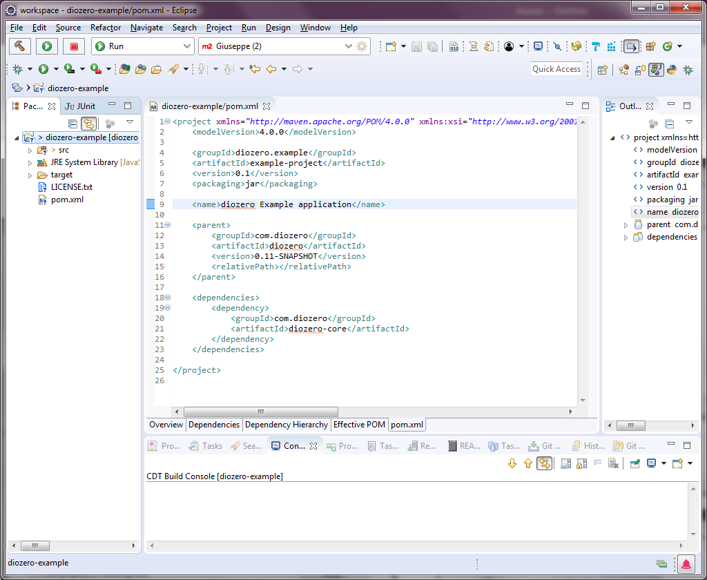
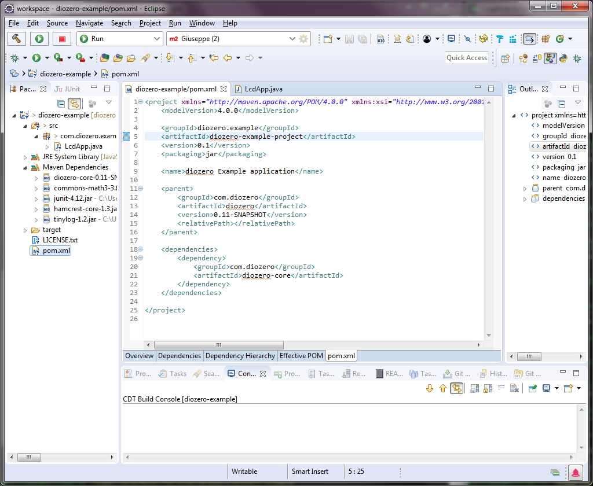

# Creating Your Own diozero Application

To create your own application that uses diozero I recommend that you use [Apache Maven](https://maven.apache.org/) to manage dependencies.
[Gradle](https://gradle.org/) also provides similar functionality however I haven't had a chance to look into using it.

There are 2 main approaches for incorporating diozero into your project using Maven

1. Reference diozero as the Maven parent. Use [diozero-example](https://github.com/mattjlewis/diozero/blob/master/diozero-example/pom.xml) as a reference.

1. Add diozero as a dependency in your application's Maven pom.xml. See my [Java Lego Car](https://github.com/mattjlewis/JavaLegoCar/blob/master/pom.xml) project as an example.
Note make sure you enable Maven snapshot repositories if you want to use a diozero snapshot build.

```xml
<repositories>
	<repository>
		<id>oss-snapshots-repo</id>
		<name>Sonatype OSS Maven Repository</name>
		<url>https://oss.sonatype.org/content/groups/public</url>
		<snapshots>
			<enabled>true</enabled>
			<updatePolicy>always</updatePolicy>
		</snapshots>
	</repository>
</repositories>
```

If you want to manage the dependencies yourself, download and extract a diozero [distribution ZIP file](https://drive.google.com/open?id=0BxA10VX9SC74VDR6WTlLOEdpYzA) from Google Drive and add tinylog-2.1.2.jar and diozero-core-0.13.jar to your project's classpath.

## Step-by-step Instructions

These instructions assume you are using Eclipse, Maven and are using diozero as the parent project.

1. Create a new Java Project

    

1. Copy the example [pom.xml](https://github.com/mattjlewis/diozero/blob/master/diozero-example/pom.xml) into your project

1. Change the groupId, artifactId and name attributes in your pom.xml

    

1. Right click on your Java project and chose Configure / Convert to Maven Project

1. Check that the Maven dependencies have been correctly imported by exanding Maven Dependencies in the Package Explorer side bar

    

1. Develop your application

1. Compile, package and distribute your application

    

## Deploy Your Application to Your Device

To package your application so you can copy it to your device again there are a number of options.

1. Export your application as a JAR file and include all run-time dependencies via the classpath.
Simply run ```mvn package``` to create the JAR file for your application.
Note this will not generate a runnable JAR hence you will need to run your application as ```java -cp tinylog-2.1.2.jar:diozero-core-0.13.jar:yourapp.jar <<your-main-class>>```.

1. You can use Eclipse to create an runnable JAR file that includes all dependencies and sets.
Note a runnable JAR file is one that can be run from the command line using ```java -jar yourapp.jar```.
First make sure you have created a run configuration so Eclipse knows the main class for your application;
right click on you main class and choose Run As / Java Application.
Then right click on your project in the Eclipse package Explorer side bar and choose Export / Java / Runnable JAR file.
Make sure you select the correct Launch configuration for your application.

    

1. Use the [Maven shade plugin](https://maven.apache.org/plugins/maven-shade-plugin/) to create a runnable JAR file that includes all dependencies. Run ```mvn package``` to create the runnable JAR file. See my [webapp project](https://github.com/mattjlewis/diozero/blob/master/diozero-webapp/pom.xml) for an example.
